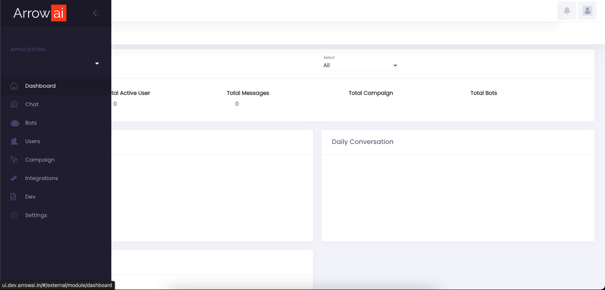

# Jigsaw UI Application Framework

An Application Framework comprising of Modular Composible Compiled Components (MCCC) where new modules can be deployed in Runtime. 

This is different from standard react applications where for any changes made to the application, the entire application has to be recompiled and redeployed. 

## Main Features
- **Load Compiled Modules**: You can load Modules during Runtime in Production, without making changes or redeploying the application.
- **Generate Modules Automatically with AI**: You can automatically Generate the Modules using AI and Integrated Code Editor. You can also bring in your own applications written in any Framework like Angular, React etc and use it as a module.

# Quickstart

The Easiest way to get started is by creating an [ArrowAI Account](http://www.arrowai.com). Jigsaw UI can also be used independently for any of your project. 

## Self Host

# Documentation

[doc]()

# Roadmap

## Other options vs Jigsaw UI

**MicroFrontends vs Jigsaw UI**

Micro Frontends like [Single SPA](https://single-spa.js.org) are Simple Frameworks that allow you to generate your own Micro-Frontend Application from Scratch, while Jigsaw UI is an application frameworks with various components already in place. You do not need to make any changes to the main application code to get started. This makes it ideal for various people who do not have a lot of experience in UI Coding to get started.

**Island Driven Frameworks vs Jigsaw UI**

Island Driven Frameworks like [Astro](https://astro.build) allow you to create 

**Composable Component Build vs Jigsaw UI**

Composable Component Build Apps like [bit.dev](https://bit.dev) allow you to manage the components in a separate registry from the application. But the Components need to be assembled during the Build time, while in Jigsaw UI, the UI Widgets are built separately and can be used during runtime, without the application being redeployed.
